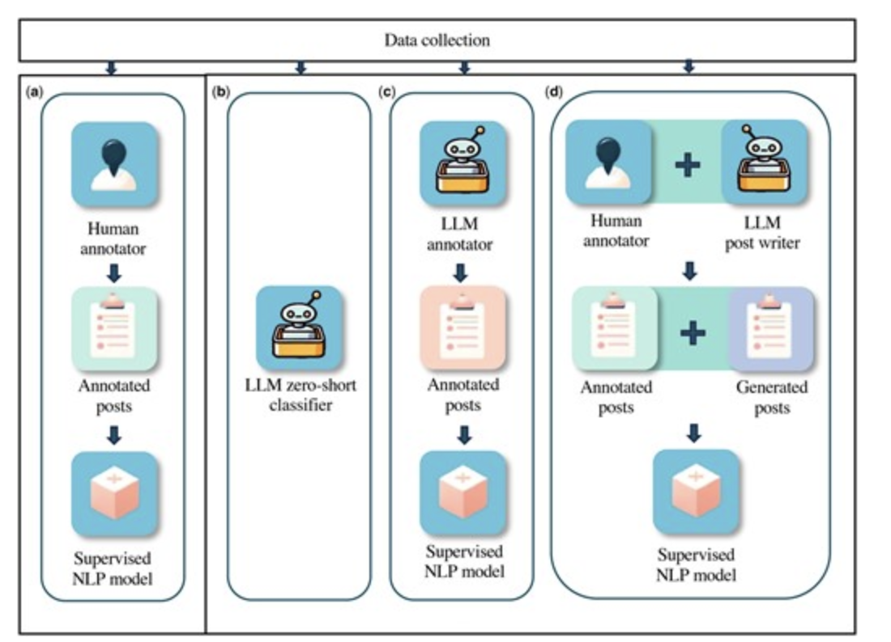

# WGU Reddit Monitoring Capstone (Prototype)

**Capstone Title**: *WGU Reddit Monitoring Pipeline with Sentiment Analysis and NLP*  
**Submission Date**: July 2025  
**Project Type**: Prototype – static, client-side GUI built on curated Reddit data  
**Author**: Buddy Owens  

---

## Project Overview

A pipeline to classify and explore Reddit posts about WGU courses.  
Includes a web-based interface with filters (course, category, sentiment, intent, college, date, search, sort).  
Posts are labeled via GPT, enriched with WGU catalog metadata, and scored using VADER sentiment (`SentimentIntensityAnalyzer` from `vaderSentiment`).

---

## Prototype Scope

This prototype uses:

- 930 posts from 2025 mentioning one of the top 20 WGU courses (multi-course posts excluded).
- Static, preprocessed dataset. No live scraping or NLP.
- Client-side HTML viewer with filters. Deployable via GitHub Pages or local browser.
- Mock dataset for prototyping only.

---

## Data Source

Reddit posts were collected from public WGU-related subreddits using the Reddit API.

### Data Collection Timeline

**Initial Population (April 24, 2025):**  
Fetched up to 1,000 posts per subreddit using PRAW. Early 2025 coverage may be incomplete due to Reddit API limits.

**Daily Collection (July 4, 2025 – Present):**  
Automated daily fetching began on July 4, 2025, as tracked by `logs/launchd_daily_update.log`. Scraping is active and considered complete from this date forward.

### Dataset Scope

- Snapshot includes posts from 2025 only.
- Due to Reddit's 1,000-post limit per subreddit, earlier posts may be missing.

### Data Captured

Each post includes:

- post_id  
- title  
- selftext  
- created_utc  

---

### Known Limitations

- Subreddit list is static. New WGU-related subreddits are not auto-detected.

---

## GPT Model Usage & Expansion Plans

### Prototype Model: `gpt-4o-mini`

Used for post classification:

- **Category** (e.g., “Assessment & Exam Content”)  
- **Intent Tag** (e.g., “help_request”)

**Classification Stats**:
- Posts classified: 930  
- Total cost: $0.12  
- Output format: JSON Schema (`response_format: {type: "json_schema"}`)

### ⚙ Supported Models for Structured Output

| Model        | Input   | Cached Input | Output  | JSON Schema |
|--------------|---------|--------------|---------|--------------|
| `gpt-4o-mini`| $0.15   | $0.075       | $0.60   | ✅ Yes       |
| `gpt-4o`     | $2.50   | $1.25        | $10.00  | ✅ Yes       |

> `gpt-4o-mini` was chosen for cost and structured output support.

---

## LLM Classification Methodology

This prototype uses **GPT-4o-mini** as a **zero-shot classifier** to label Reddit posts by category and intent. The approach follows Guo et al. (2023) [JAMIA](https://doi.org/10.1093/jamia/ocad173), which benchmarked LLMs against traditional classifiers on social media text. Their results show that zero-shot LLMs (especially GPT-4) often match or exceed supervised baselines.

We adopt their **LLM-as-classifier** strategy (see diagram below), prompting GPT with strict definitions and schema constraints.




### Prompt Used

```python
system_msg = "You are a classifier for Reddit posts about university courses."
prompt_template = """\
Classify it using one or more of the following categories (by number):
0: Assessment & Exam Content — PA, OA, proctoring, retaking, etc  
1: Course Content Issues — outdated, incorrect, missing, or misleading course material  
2: Study Support & Resources — study materials, guides, notes, etc  
3: Course Planning & Timing — degree plan, course order, pacing guide, timeline  
4: Celebration & Motivation — passing, graduating, confetti, encouragement  
5: uncategorized — not fitting into other categories

INTENT TAGS (optional):
0: help_request — explicit asks for help, support, etc  
1: advice_offered — offering advice, tips, etc

Return the following JSON structure:

{
  "post_id": "<id>",
  "categories": [...],
  "intent_tags": [...]
}
"""
```

### Implementation Notes

- Categories are **multi-label, conservative**
- Intent tags are optional; `help_request` requires an **explicit** ask
- Posts with no clear match default to category `[5]` and empty intent
- Structured output enforced using `response_format: {type: "json_schema"}`

### Processing Strategy

- Posts are batched by course: ≤10 posts or ≤5,000 characters
- Posts >10k characters are flagged or summarized
- Outputs are logged with post IDs, input lengths, and classification mode (batched, solo, flagged)
- Results are stored per course in `*_classified.jsonl` files

Classification enables downstream sorting, filtering, and monitoring tasks in the GUI. Total cost: **$0.12** for 930 posts.

---

## Planned Expansion

### 1. Open-Source LLMs with Ollama

We plan to evaluate local models via Ollama for private, token-free classification and summarization.  
Enables fast, reproducible workflows using models like LLaMA 2 and Mistral.

---

### 2. Multi-Pass LLM for Pain Point Extraction

Future stages will apply LLMs to extract summaries and pain points.

#### Pass 1: Group Posts

Grouped by course, category, and intent into problem areas.

#### Pass 2: Extract "Pain Points"

Each cluster gets a descriptive title and post references.

**Example (Course: D427)**  
Pain Point: **Chapters 7 & 8 Update**

| post_id   | Title                                            |
|-----------|--------------------------------------------------|
| 1kezkuh   | Are Chapters 7 & 8 still on OA?                  |
| 1kffhci   | ZyBooks Lab 7/8 missing?                         |
| 1lepi38   | D427 updated? OA same as before?                 |
| 1kda0zr   | Did D427 change for enrolled students?           |

Emerging pain points may also be flagged.

---

### 3. Including Comments

Comments are important for help-seeking and advice.  
Currently fetched up to 3 per level (2 levels deep). Only comments made before post fetch are included.  

**Planned**:  
Re-fetch selected posts (based on `num_comments`, classification, sentiment) to enable comment-level analysis.

---

## Possible Expansion

### 1. Feedback by Institutional Area

Posts may be grouped by broader WGU areas beyond courses, such as:

- Degree programs (e.g., MBA, IT)  
- Financial aid, tuition  
- Admissions, transfers  
- Student support centers  
- Advising and mentoring  

Could support analysis of real-time, unsolicited student feedback.

---

### 2. WGU Mentions Beyond Known Subreddits

Future iterations may capture posts mentioning “WGU” across broader Reddit communities.

Potential insights:

- What prospective students say in general forums  
- Mentions outside student channels (e.g., r/college)  
- Institutional reputation tracking

---

## WGU Catalog Scraper

A catalog parser was used to generate metadata but is not included in this repo.

### Used Outputs

- **`college_snapshots.json`**  
  College names from 2017–2024 (used April 2024 snapshot)

- **`2025_06_course_list_with_college.csv`**  
  Course list from June 2025, used to map titles and colleges to posts

> Course-to-college mappings were manually spot-checked.

This prototype uses only the 2025 catalog for simplicity.

---

## Dataset Description for GUI

Each post uses this JSON structure:

```json
{
  "post_id": "1abcxyz",
  "title": "How do I pass the OA?",
  "selftext": "...",
  "permalink": "/r/WGU/comments/1abcxyz/...",
  "created_utc": 1745101200,
  "created_date": "2025-07-19",
  "course_code": "C207",
  "course_title": "Introduction to Data-Driven Decision-Making",
  "colleges": ["School of Business"],
  "text_length": 271,
  "VADER_Compound": 0.78,
  "categories": ["Assessment & Exam Content", "Study Support & Resources"],
  "intent_tags": ["help_request"]
}
```