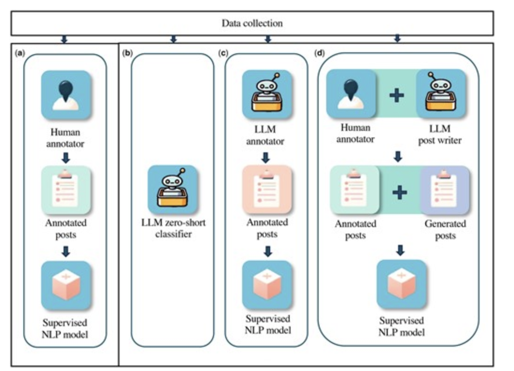

## WGU Reddit Feedback Analyzer

- **Project Title:** WGU Reddit Monitoring and Feedback Clustering Tool  
- **Purpose:** Analyze unsolicited student feedback on Reddit to surface and cluster course-related *pain points*  
- **Project Type:** Interactive web app built on curated Reddit data using NLP and sentiment classification  
- **Features:** Includes downloadable (PDF) course-level feedback sheets  
- **Author:** Buddy Owens (<jowe160@wgu.edu>)  
- **Live Demo:** [Launch Dashboard](https://wgudataninja.github.io/WGU-Reddit-Feedback-Analyzer/index.html)  
- **Notes:** Developed in support of WGU Data Analytics Capstone work  
---

## Project Goals
- Extract relevant posts from our custom database of over 20k posts from WGU-related subreddits.
- Identify *pain points* expressed by the user, about the course.
- Cluster similar pain points by root cause to reveal common issues by course.
- Deliver structured, quote-backed, course-level summaries for curriculum designers, instructors and mentors.

## Motivation

While WGU conducts formal feedback surveys, students also post candidly on Reddit. These unfiltered posts often highlight 
pain points not captured by traditional surveys. This project aims to harness those insights for potential course improvement.

---

## Project Structure

```text
├── data/                                      
│   └── 2025_06_course_list_with_college.csv   # current course list (July 2025 WGU Catalog)
├── db/
│   └── WGU-Reddit.db                          # SQLite database 
├── fetchers/                                  # Daily Reddit API fetch scripts
├── outputs/
│   ├── stage1_pain_points/                    # Extracted pain points (JSONL)
│   └── stage2_clusters/                       # Clustered pain points by course (JSON)
├── scripts/
│   ├── stage1/                                # LLM Loop 1: Extract Pain Points
│   │   ├── step01_fetch_filtered_posts.py     
│   │   ├── step02_classify_post.py            
│   │   ├── step03_classify_file.py            
│   │   └── step04_run_stage1.py               
│   └── stage2/                                # LLM Loop 2: Cluster Pain Points
│       ├── step01_group_by_course.py          
│       ├── step02_prepare_prompt_data.py      
│       ├── step03_call_llm.py                 
│       ├── step04_apply_actions.py            
│       └── step05_run_stage2.py               
├── utils/                                     # Cleaning functions, etc.
├── docs/                                      # Project documentation and prompts
└── README.md                                  # You are here
```
### Prototype
The first version of this project was a single-pass LLM categorization of Reddit posts, 
and is still available in [the prototype dashboard](https://wgudataninja.github.io/WGU-Reddit-Feedback-Analyzer/prototype/index.html).

## LLM Classification Methodology

This project uses **GPT-4o-mini** in a *guided zero-shot* configuration — with carefully defined roles, terminology, and instructions — to extract and cluster student pain points from Reddit posts.

Inspired by Guo et al. (2023) [JAMIA](https://journals.aai.org/jamia/article/31/10/2181/7731085), we follow their **LLM-as-classifier** framework (see graphic below). Rather than providing labeled examples, we guide the model using:

- Clear role assignment (e.g., “You are a course designer...”)
- Domain-specific definitions (*pain point*, *root cause*)
- JSON schema constraints for structured output
- Explicit instructions to merge similar issues under a single root cause

In the clustering stage, the LLM is also allowed to **rename clusters** to avoid fragmentation — broadening cluster titles and summaries to include edge cases when appropriate.

<p align="center">
  
</p>
<br clear="all"/>

## Project Overview

### Stage 1 – Pain Point Extraction

Reddit posts filtered for low sentiment ( < -0.2 ) and single course mention

**Input:**  
`data/filtered_posts_stage1.jsonl`

Reddit Post Schema:
```json
{
  "post_id": "abc123",
  "course_code": "C949",
  "title": "OA instructions unclear for C949",
  "selftext": "I’m struggling with C949 because the OA instructions are really unclear.",
  "subreddit": "WGU",
  "permalink": "https://www.reddit.com/r/WGU/comments/abc123/some_title"
}
```

<details>
<summary><strong>Stage 1 Prompt: Pain Point Extraction</strong></summary>

<br>

**Definitions:**

A 'pain point' is a negative user experience that a student encounters in a course,  
traceable to how the course is designed, delivered, or supported.

A pain point must be directly tied to the course, with a potential 'root cause'.

A 'root cause' is the stated or implied fixable deficiency in the course  
that contributed to the student’s negative experience. It must be something the course designer could reasonably improve.

---

**Your Task**

You are a course designer reviewing Reddit posts about course `{course_code}`.

1. Decide if the post contains one or more distinct pain points.  
2. For each pain point:
   - Summarize the student’s struggle in one sentence.
   - Identify the root cause.
   - Include a short, relevant, quoted snippet from the post that captures the issue in their own words.

> Merge multiple complaints into a single pain point if they share the same root cause.

---

If no course-related pain points are present:

```json
{
  "num_pain_points": 0
}
```
</details>
        
***


### Stage 2 – Clustering Pain Points by Root Cause

Each course’s pain points are grouped into clusters based on root cause, using a second GPT prompt.

**Input:**  
`outputs/stage1_pain_points/pain_points_stage1.jsonl`

<details>
<summary><strong>Stage 2 Prompt: Cluster Assignment</strong></summary>

<br>

You are organizing student pain points from social media posts to present to the course design team for course `{course}`.

You will receive a small batch of pain points. Your task is to group them into distinct clusters based on root cause — the underlying issue that the course team could address.

If clusters already exist, they are listed below. Each includes:
  - cluster_id  
  - title  
  - root cause summary  
  - number of posts  

For each pain point:
- Assign it to an existing cluster if the root cause matches  
- If it nearly fits, you may assign it and optionally suggest a new title and summary to better reflect the updated scope  
- If it doesn’t fit any, propose a new cluster  

Avoid fragmentation by reusing clusters when possible. Every pain point must be clustered.  
Avoid creating unnecessary new clusters. Favor assignment and renaming existing clusters if the issue is broadly related.

Return ONE compact JSON object per pain point.  
Use the exact `pain_point_id` from the input. Do not rename, abbreviate, or simplify it.

**Format:**

```json
{
  "pain_point_id": "string",
  "action": "assign", 
  "cluster_id": "C949_3", 
  "cluster_title": null,
  "root_cause_summary": "Mentor feedback delays are a recurring issue."
}
```

</details>

**Output:**  
`outputs/stage2_clusters/C949_clusters.json`

Each ***[course_code]clusters.json*** contains a list the clusters (Feedback Topics) their pain_point_ids. 

```json
{
  "course": "C949",
  "clusters": [
    {
      "cluster_id": "C949_1",
      "title": "Unclear OA expectations",
      "root_cause_summary": "OA instructions lack clarity on requirements",
      "pain_point_ids": ["abc123_0", "def456_1"],
      "is_potential": false
    },
    {
      "cluster_id": "C949_2",
      "title": "Mentor unavailable for help",
      "root_cause_summary": "Students report that mentors were unresponsive or unable to help",
      "pain_point_ids": ["ghi789_0"],
      "is_potential": false
    }
  ],
  "alert_threshold": 5,
  "alerts": []
}
```
### Sample Course Feedback Output

The final GUI or markdown generator will combine:

- **Cluster titles** from `*_clusters.json`
- **Quoted pain points** from `pain_points_stage1.jsonl`
- **Reddit post links** from the original post metadata

to produce a readable course feedback document for curriculum reviewers.

---

#### D335 – Introduction to Programming in Python  
**School of Technology** • **10 Discussion Topics** • **23 Student Pain Points**

---

### Discussion Topics

The following topics represent common themes and pain points discussed by students in relation to this course on Reddit.

---

### Assessment Difficulty  
*Students perceive inconsistency in difficulty levels between practice tests and actual assessments.*

**Student Feedback:**

> "I had solved every problem except the csv files, and try-except problem."  
[View on Reddit →](https://reddit.com/comments/example1)

> "There were two long, difficult problems in chapter 28... There wasn't anything approaching those on the OA."  
[View on Reddit →](https://reddit.com/comments/example2)

> "Is the OA for D335 more similar to practice test 1 or 2?"  
[View on Reddit →](https://reddit.com/comments/example3)

---

### Course Material Comprehension  
*Students feel overwhelmed by the complexity of course material, leading to confusion around key concepts.*

**Student Feedback:**

> "I feel like I'm losing my mind with this course."  
[View on Reddit →](https://reddit.com/comments/example4)

> "I've stared at this for 10 minutes...........what am I missing?"  
[View on Reddit →](https://reddit.com/comments/example5)

> "I just don't understand this course... zybooks THEY DO NOT HELP!, Angela's 100 days course - NO HELP!"  
[View on Reddit →](https://reddit.com/comments/example6)


---

## Planned Expansion

### 1. Open-Source LLMs with Ollama

We plan explore local models via Ollama for private, token-free processing using models like LLaMA 2 and Mistral.

### 2. Including Reddit Comments

Comments are important for help-seeking and advice.  
Currently, we fetch up to 3 comments per level (2 levels deep), captured only if posted before the main post was fetched.

**Planned**:  
Re-fetch selected posts (based on `num_comments`, classification, sentiment) to include full comment threads and support deeper analysis. Possible to expand toward 
tracking "advice" as well as "pain-points"

---

## Possible Expansion

### 1. Feedback by Institutional Area

In addition to course-level feedback, posts may be grouped by broader WGU areas such as:

- Degree programs (e.g., MBA, IT)  
- Financial aid, tuition  
- Admissions, transfers  
- Advising and mentoring  
- Student support services  


### 2. Beyond Known Subreddits

Analyzing posts from keyword search from ***outside*** the known wgu-related subreddits could provide insight 
into what non-students are saying about WGU. This would allow visibility into brand perception and prospective student sentiment.
Posts would come from any subreddits, including:
- r/college  
- r/gradadmissions  
- r/personalfinance  
- Other topic-specific communities  


### 3. Sentiment Filter Adjustment

Current filtering emphasizes **negative sentiment (VADER < -0.2)** to surface pain points.  
We may later include neutral and positive posts to:

- Detect hidden pain points in seemingly positive experiences  
- Balance insights with strengths and success stories