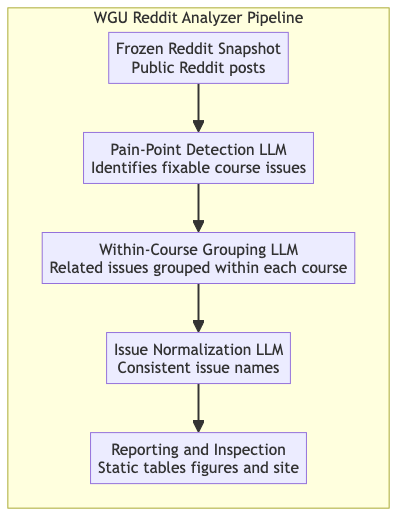

# WGU Reddit Analyzer

## Overview

Western Governors University provides many official channels for students to seek academic help and support, but Reddit is not one of them. Despite this, many WGU students use Reddit to ask questions, express frustration, and discuss course experiences across more than 50 WGU-related subreddits. These unsolicited and informal conversations represent a large, fragmented body of feedback that is difficult to analyze using traditional methods.

The **WGU Reddit Analyzer** is a reproducible research pipeline that uses large language models (LLMs) to transform this unstructured social media discussion into structured, analyzable data. The pipeline produces course-level issue summaries, cross-course issue categories, and deterministic reporting tables suitable for academic analysis.

A read-only static website presents selected outputs and can be accessed  
[here](https://wgudataninja.github.io/WGU-Reddit-Feedback-Analyzer/).

---

## Scope and Non-Goals

### In Scope

- Public Reddit posts from WGU-related subreddits  
- Posts referencing exactly one identifiable WGU course  
- Sentiment-based filtering to focus analysis on negative experiences  
- LLM-based classification, clustering, and synthesis  
- Artifact-driven reproducibility with stored outputs  
- Cost and latency tracking for LLM stages  

### Out of Scope

- Reddit comments or full discussion threads  
- Posts referencing multiple courses  
- Neutral or positive sentiment posts  
- Causal claims or evaluation of course quality  

---

## Dataset Overview

At a high level:

- Roughly 27,000 Reddit posts were initially collected into a local database  
- Filtering based on sentiment and course-code rules produced a frozen analysis corpus of **1,103 posts**  
- These posts reference **242 WGU courses** across **51 subreddits**  
- A separate benchmark sample of approximately 200 posts (combined DEV and TEST candidates) was manually labeled for evaluation purposes  

Counts represent posts, not students, outcomes, or prevalence.  
Detailed collection and filtering rules are documented in the pipeline specification.

---

## Pipeline Overview

The analyzer is implemented as a staged pipeline. Each step produces stored artifacts that are reused downstream.

  

### Frozen Reddit Snapshot

A fixed dataset of public Reddit posts is constructed once and treated as immutable by all downstream stages.

### Pain-Point Detection

Each post is independently evaluated by an LLM to determine whether it contains a fixable, course-side pain point.
Outputs follow an explicit schema, and parsing or schema errors are preserved and recorded rather than discarded.

Prompt and model selection for this stage are informed by documented benchmarking and evaluation procedures.

In this repository, *refined* is a narrative label for the selected prompt. Executable authority comes from prompt
snapshots stored with each run’s artifacts.

### Course-Level Grouping

Posts identified as containing course-side issues are grouped within each course into recurring issue clusters.
This step aggregates individual complaints into higher-level themes while preserving traceability.

### Issue Normalization

Course-level issue groups are normalized into shared issue names across courses. This resolves differences in wording
and granularity while enabling cross-course analysis.

### Reporting and Inspection

Final reporting tables and figures are produced deterministically from stored artifacts. No LLMs are used beyond the
normalization stage.

A complete, authoritative description of pipeline behavior lives in  
[`docs/PIPELINE_SPEC.md`](docs/PIPELINE_SPEC.md).

---

## Evaluation and Benchmarking

Pain-point detection is treated as a classification task with frozen DEV and TEST splits. Evaluation uses standard
classification metrics, with clearly defined exclusions and error handling rules.

Prompt iteration is guided by paired statistical testing to reduce regressions. Benchmarking is evaluative and does not
define core pipeline guarantees. Operational metrics such as cost and latency are tracked for analysis.

Benchmark runs require explicit prompt and model flags. Code defaults are historical and non-runnable.

Detailed documentation is available in:

- [`docs/BENCHMARK_GUIDE.md`](docs/BENCHMARK_GUIDE.md)  
- [`docs/COST_ESTIMATION.md`](docs/COST_ESTIMATION.md)  
- [`docs/LABEL_GUIDE.md`](docs/LABEL_GUIDE.md)  

---

## Methodological Grounding

The pipeline design is informed by recent research on LLM-based classification and large-scale qualitative analysis of
social media data. These influences shape the project’s emphasis on fixed datasets, explicit schemas, staged processing,
and evaluation-guided prompt refinement.

A full discussion of these influences is documented in  
[`docs/METHODOLOGICAL_FOUNDATIONS.md`](docs/METHODOLOGICAL_FOUNDATIONS.md).

---

## Reproducibility

All results presented in the accompanying paper and static website are derived from authoritative artifacts produced by
pinned runs.

- Reported results are pinned to specific runs  
- Downstream tables can be rebuilt deterministically  
- Reproduction does **not** require re-running any LLM stages or API access  

Authoritative run pins and rebuild instructions are documented in  
[`docs/PAPER_RUNS.md`](docs/PAPER_RUNS.md).

---

## Static Website (GUI)

The repository includes a static website that presents selected outputs of the pipeline.

The site:

- displays precomputed artifacts only  
- performs no analysis or inference  
- supports exploration of courses, issue categories, and source posts  

The website is a presentation layer, not an analytical component. All interpretation belongs to the pipeline artifacts
and the paper.

Documentation for the site lives in  
[`site/README_SITE.md`](site/README_SITE.md).

---

## Repository Structure

- `src/` — pipeline implementation  
- `artifacts/` — stored outputs for all stages  
- `docs/` — specifications, benchmarks, labeling guides, and paper references  
- `prompts/` — LLM prompt templates  
- `site/` — static website source  
- `archive_legacy/` — deprecated prototypes  

Changes to the project over time are tracked in  
[`CHANGELOG.md`](CHANGELOG.md).

---

## Ethics and Limitations

- Only public Reddit posts are used  
- Usernames are removed from stored artifacts  
- Displayed excerpts are truncated and privacy-reviewed  
- Results are aggregate and not representative of all student experiences  

This project is intended for research and methodological exploration, not institutional evaluation.

---

## What This Work Demonstrates

This project shows that large language models can be used in a disciplined, reproducible way to structure large volumes
of informal social media discussion into data suitable for academic analysis.

Applied to Reddit posts about WGU courses, the pipeline transforms scattered, unsolicited student discussion into stable
issue summaries and cross-course categories while preserving traceability and transparency.

While this repository focuses on course-related pain points, the same approach could support other research questions
about student discussion, given appropriate evaluation.